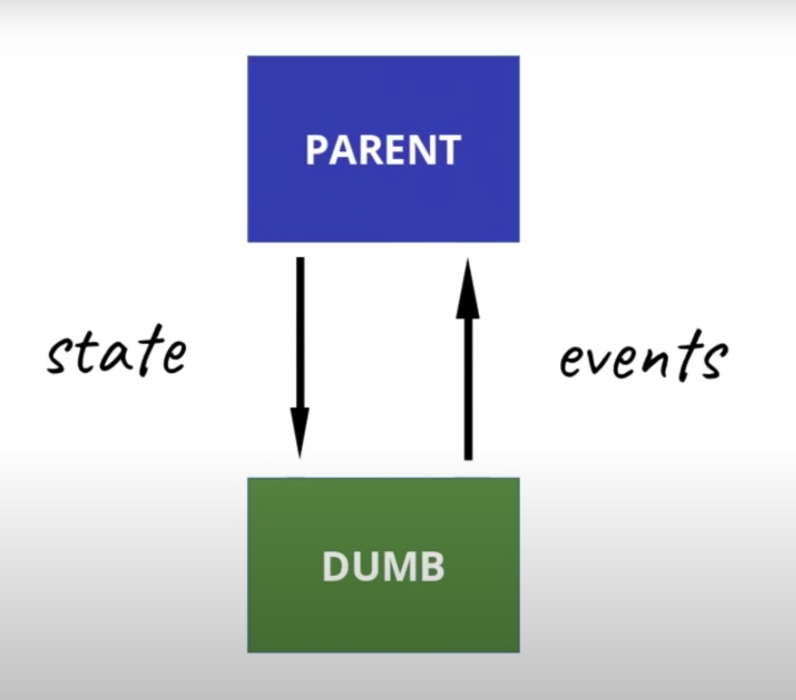
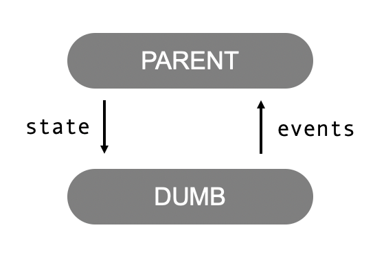
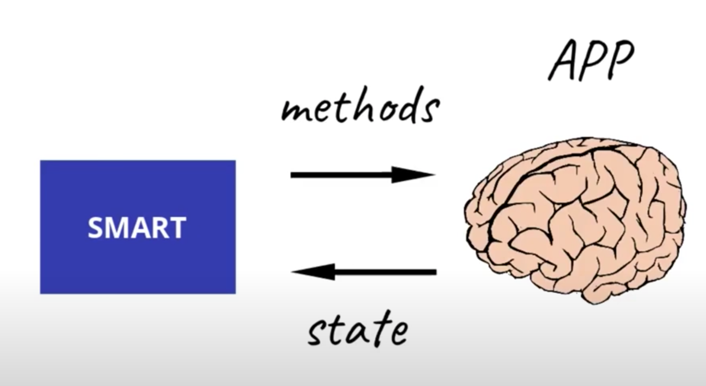
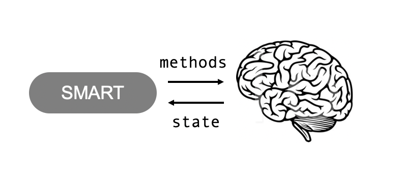
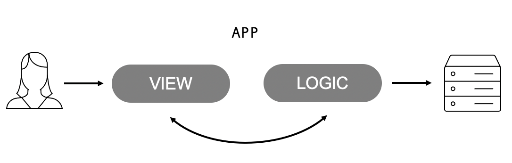

# Build React Components - Smart or Dumb

## Introduction
When you’re working with React.js, you’ll notice the power and versatality that comes with components. Components are the building blocks of a React application. Individual components are created and then nested together to build up an app. These components save us time by decomposing the user interface into reusable code, and this, makes our code easier to read and understand. 

Components are broadly classified into two categories:
1. Smart Components
2. Dumb Components

## What makes components Smart or Dumb?
Smart component are app-level components that perform functions and handle data, while dumb components are primarily concerned with the user interface. Let's dive deep into what this actually means.

### Dumb Components
* Dumb components, or ‘presentational’ components are stateless components (in most cases) which only present something to the DOM. 
*  It displays exactly what it is provided with. No changes, no modifications 😌. 
* Much more efficient than a stateful one, because they don't require as many computer resources to render (memory, CPU, and GPU in terms of graphic-intensive apps).
* Have no dependencies with the rest of the app (such as actions or stores) 
* Rarely have their own state (when they do, it’s UI state rather than data)

<!--  -->
<div style="text-align:center"></div>

In short, a dumb component just gets all of its states from the parent component and raises events when something happens. It has no context of the application, making it very **reusable**!


Examples: Header and footer. 
The component can be written in one place and used several times throughout the app, just render, and each instance of that component will look the same. If you want to change how it looks, you only have to change it in one place. This change is then reflected in all the places this component is used.

` Dumb components focus on how things look`


### Smart Components
* Smart components, or 'container' components on the other hand are stateful components. 
* Keep track of the state and all the changes. 
* Have a mighty responsibilty to work on life-cycle methods, capture changes, APIs, libraries, etc., and have to pass them down to the other components of the application. 
* They have to offer functionality to the app, after all (Phew!) 
*  Do the heavy lifting 🏋️ and pass the data down to the presentational components as props. 
* These components maintain state and also often contain callback functions to update the state. 
* Are usually generated using higher order components such as connect() from React Redux.

<!--  -->
<div style="text-align:center"></div>
These smart components should inject app level services. They get state, call methods and finally pass on this information to the dumb components.

Example - The app component is an example of a smart component. The app component is responsible for maintaining several pieces of state for the entire app. It also passes down additional functions to its child components so that the state can be updated when a user interacts with the site.

` Smart components focus on how things work`

<!--  -->
<div style="text-align:center"></div>

### More examples

1. Navigation Bar component: Dumb

A **NavBar component** expects props such as isAdmin (if person is admin or user), isSignedIn (if person is signed in or signed out)

```JavaScript
import React from 'react';
import { Link } from 'react-router-dom';
import PropTypes from 'prop-types';
import styles from './NavBar.module.css';

const NavBar = ({ isAdmin, isSignedIn }) => (
  <nav>
    <ul>
      <div className={styles.leftContent}>
        <Link to="/home">
          My Demo Application
        </Link>
      </div>
      <div className={styles.rightContent}>
        <Link to="/courses-list">
          Courses
        </Link>
        <Link to="/books-list">
          Books
        </Link>
        {isAdmin ? (
          <Link to="/admin-section">
            Admin
          </Link>
        ) : null}
        {isSignedIn ? (
          <button type="button" className={styles.button}>Logout</button>
        ) : (
          <button type="button" className={styles.button}>Login / Register</button>
        )}
      </div>
    </ul>
  </nav>
);

export default NavBar;

NavBar.propTypes = {
  isAdmin: PropTypes.bool.isRequired,
  isSignedIn: PropTypes.bool.isRequired,
};
```

Based on the props being sent we conditionally render the NavBar tabs.

 
 When user is not signed in we see a Login / Register button

 
When an admin logs in, navbar displays an admin tab for admin priveleges


In the case when a normal user logs in, we do not see an admin tab

This NavBar component can be used throughout the app by just modifying the props that are being passed. This component  will have different tabs based on the user status. All of the props are 'Contextually Relevant' i.e., they are relevant to the context in which they're placed. This component is dumb and only renders what is being passed to it, without any changes. 

2. App Component: Smart 

```JavaScript
import React, { useState, useEffect } from 'react';
import NavBar from './components/NavBar/NavBar';

const App = () => {
  const [isAdmin, setIsAdmin] = useState(false);
  const [isSignedIn, setIsSignedIn] = useState(false);

  const getRole = () => {
    const role = localStorage.getItem('role');
    if (role === 'admin') { return true; }
    return false;
  };

  useEffect(() => {
    setIsAdmin(getRole());
    const token = localStorage.getItem('token');
    setIsSignedIn(!!token);
  });

  return (
    <div>
      <NavBar isAdmin={isAdmin} isSignedIn={isSignedIn} />
    </div>
  );
};

export default App;
```
This smart **App component** deals with life-cycle methods. It gets the token and role from local storage and sets the state accordingly. These are then sent as props to our dumb component - NavBar which conditionally renders the tabs.


## Benefits of having smart and dumb components
1. Better separation of concerns. The app is easier to manage and modify.
2. Better reusability. You can use the same presentational component with completely different sources that can be used in multiple places.
3. Presentational components allows the designer tweak all their variations without touching the app’s logic. This allows us to extract “layout components” such as Sidebar, Page, Header, Footer and use props to determine what to display instead of duplicating the same markup and layout in several container components.